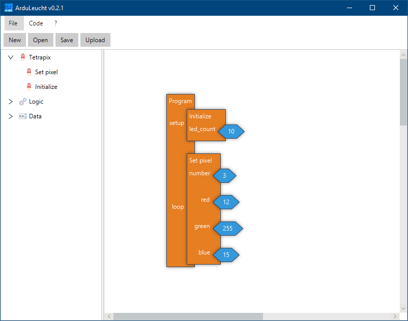

# ArduLeucht
(this is german for ArduGlow)

## Pre-Release Disclaimer
This is a pre-release. Some things might not yet work as expected. If something doesn't work, open an issue. If you'd like to have a feature added, open an issue. If you plan on using ArduLeucht in a production environment, you should have some kind of automatic
updating solution. Feel free to contact me at the e-mail below (German & English).

Important: To get log output, go to the install folder and start the `ArduLeucht.jar` file by opening `cmd` and typing `java -jar ArduLeucht.jar`. This way, you'll get error messages if something goes wrong. Without these messages I **cannot** fix most bugs.

## Introduction
This project aims to create an up to date and easy to use coding software for the [Tetrapix](https://tetrapix.de) project. The latest official version does not run in limited environments (such as some school systems), and also uses outdated Arduino and Ardublock versions. The usability of the block code editor could also greatly be improved.

## Features
- Block code editor
- Very Easy to use
- Modern and simple GUI
- Runs in limited environments (e.g. schools)

## Installation
**Important**: Before you can use this software, you must download the Digispark drivers. Download them here: https://github.com/digistump/DigistumpArduino/releases. **You only need the drivers, located in Digistump.Drivers.zip!**

After installing the drivers, download the latest ArduLeucht from here https://github.com/Twometer/ArduLeucht/releases.

## Screenshots

## Reporting bugs
To report a bug or request a new feature, please use the [GitHub issues](https://github.com/Twometer/ArduLeucht/issues/new/choose) system.

For more complicated or individual issues, you can contact me here: [support@twometer.de](mailto:support@twometer.de)

## Credits
- This is based on the Arduino Project
- The idea for this comes from Tetrapix
